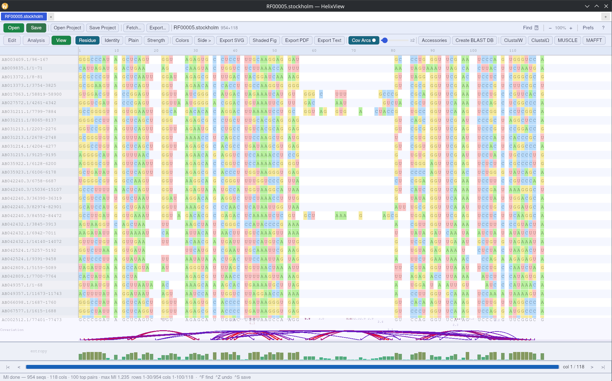

# HelixView

A fast, modern, cross-platform biological sequence alignment editor — a free replacement for BioEdit.



## Features

- **Alignment editor** — open, edit and export FASTA, Clustal, GenBank, PHYLIP, Stockholm and more; insert/delete gaps, rename sequences, undo/redo
- **Colour schemes** — nucleotide, amino acid, Clustal and conservation-based colouring
- **Entropy strip** — per-column Shannon entropy displayed live below the alignment
- **RNA covariation (MI)** — mutual information for all column pairs; Watson–Crick scoring highlights candidate stem–loops; adjustable thresholds; pairing-arc overlay
- **Circular plasmid map** — visualise GenBank features on a circular canvas; edit colour, name and position per feature; restriction sites overlaid automatically
- **Phylogenetic tree** — neighbour-joining tree built from the open alignment; click leaves to select sequences
- **BLAST integration** — remote NCBI BLAST or local database search; results import back into the alignment
- **Sequence fetch** — retrieve sequences from NCBI (GenBank/FASTA) or UniProt by accession, comma-separated for batch import
- **Six-frame translation** — all six reading frames with ORFs and stop codons highlighted
- **Hydrophobicity profiles** — Kyte–Doolittle windowed plots for membrane-region identification
- **ABI trace viewer** — Sanger chromatogram display with zoom and quantification panel
- **CLI companion** — `helixview-cli` provides `stats`, `entropy`, `consensus`, `mi`, `identity` and `convert` for scripting

## Download

Pre-built binaries for Windows, macOS and Linux are available on the [Releases](https://github.com/librebiology/helixview/releases) page.

| Platform | File |
|----------|------|
| Windows 10+ (64-bit) | `helixview-windows-x64.msi` |
| macOS 12+ (Universal) | `HelixView-macos.dmg` |
| Linux x86-64 | `HelixView-x86_64.AppImage` |

## Build from source

Requires [Rust](https://rustup.rs/) 1.77 or later.

```bash
git clone https://github.com/librebiology/helixview.git
cd helixview
cargo build --release
# GUI
./target/release/helixview
# CLI
./target/release/helixview-cli --help
```

Optional external tools (not required to build):
- `mafft` — external multiple sequence alignment
- `makeblastdb` / `blastn` / `blastp` — local BLAST database creation and search

## Workspace layout

```
crates/
  helixview-core       # sequence, alignment and feature data model
  helixview-formats    # parsers: FASTA, GenBank, Clustal, PHYLIP, Stockholm, ABI, …
  helixview-analysis   # MI, entropy, identity matrix, NJ tree, restriction sites
  helixview-external   # BLAST and MAFFT subprocess wrappers
  helixview-ui         # iced GUI
  helixview-cli        # command-line interface
```

## License

GPL-3.0-or-later — see [LICENSE](LICENSE).
